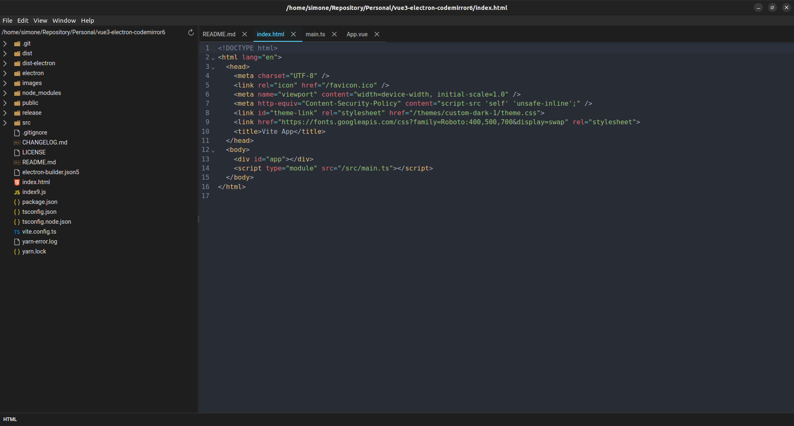

# Editor



# Codemirror 6

Puoi trovare la documentazione ufficiale su [https://codemirror.net/](https://codemirror.net/).
In particolare ti consiglio di vedere qualche [esempio](https://codemirror.net/examples/) e la documentazione tecnica partendo dalla [system guide](https://codemirror.net/docs/guide/)

## Autocompletamento

```javascript
let state = EditorState.create({
  doc: "",
  extensions: [
    basicSetup,
    search({ top: true }),
    oneDark,
    markdown({ codeLanguages: languages }),
      autocompletion({
      activateOnTyping: true,
      defaultKeymap: true,
      override: [
        completeFromList([
          { label: "heading 1", apply: "#", type: "function" },
          { label: "heading 2", apply: "##", type: "function" },
          { label: "heading 3", apply: "###", type: "function" },
          { label: "heading 4", apply: "####", type: "function" },
          { label: "code", apply: "``", type: "function" },
          { label: "fenced code", 
          apply: (view, completion, from, to) => {
              const textToInsert = '```shell\n```';
              const pos = view.state.selection.main.head;
              const changes = [
                { from: pos, to: pos, insert: textToInsert },
                { from: from, to: to },
              ];
              view.dispatch({
                changes: changes,
                selection: { anchor: pos + 1, head: pos + 6 },
              });
            },
          type: "function" },
          { label: "list", apply: "-", type: "function" },
          {
            label: "bold",
            apply: (view, completion, from, to) => {
              const textToInsert = `**text**`;
              const pos = view.state.selection.main.head;
              const changes = [
                { from: pos, to: pos, insert: textToInsert },
                { from: from, to: to },
              ];
              view.dispatch({
                changes: changes,
                selection: { anchor: pos + 1, head: pos + 5 },
              });
            },
            type: "function",
          },
          {
            label: "italic",
            apply: (view, completion, from, to) => {
              const textToInsert = `**`;
              const pos = view.state.selection.main.head;
              const changes = [
                { from: pos, to: pos, insert: textToInsert },
                { from: from, to: to },
              ];
              view.dispatch({
                changes: changes,
                selection: { anchor: pos + 1, head: pos + 1 },
              });
            },
            type: "function",
          },
        ]),
      ],
    })
  ],
});
```
